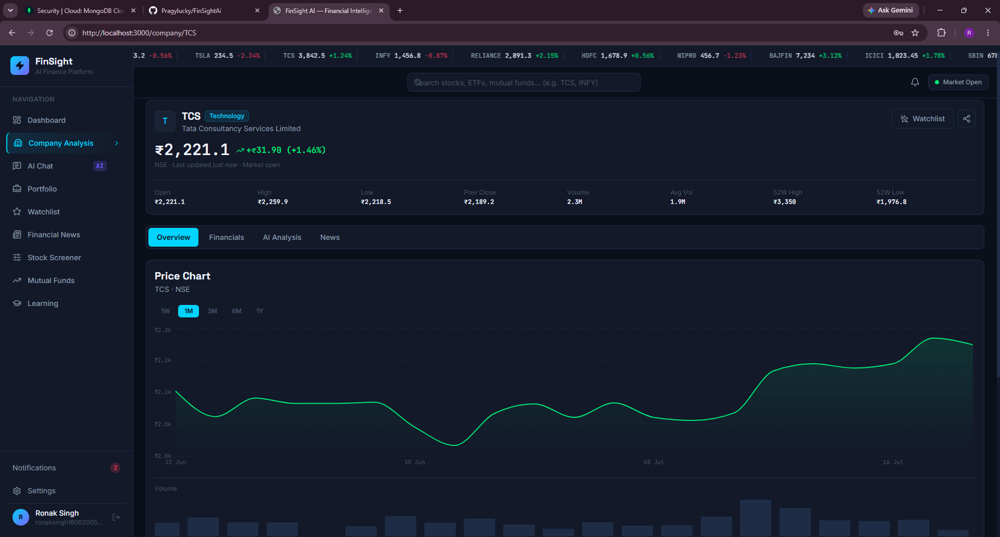
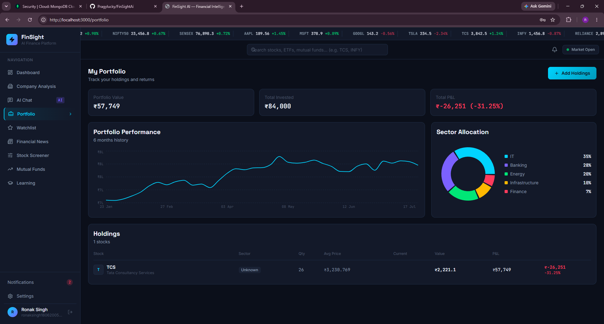
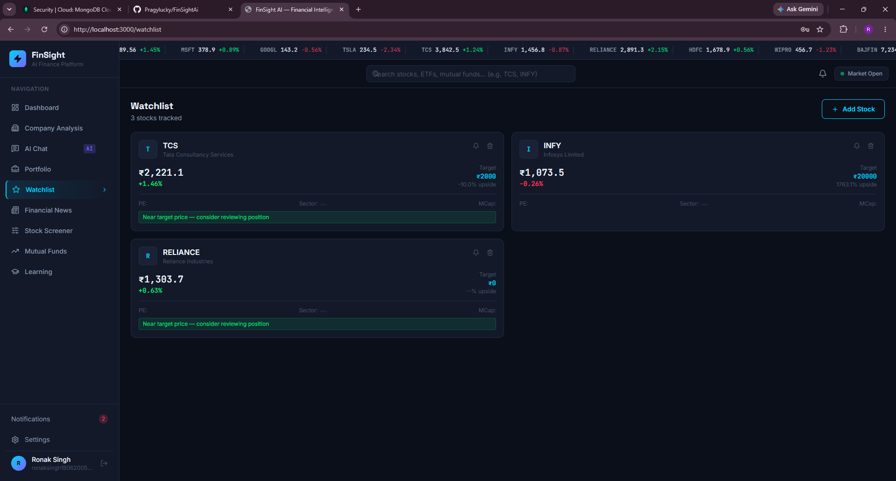
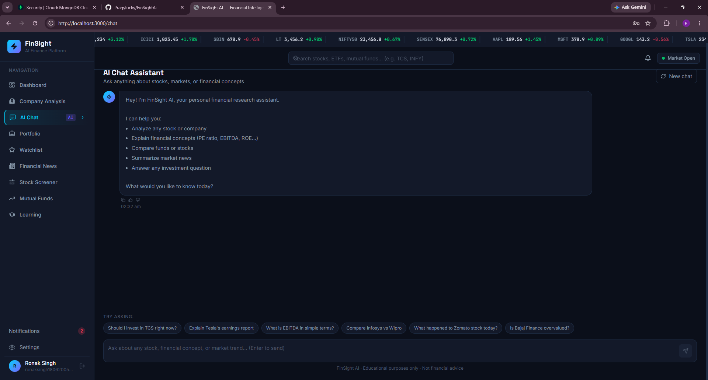
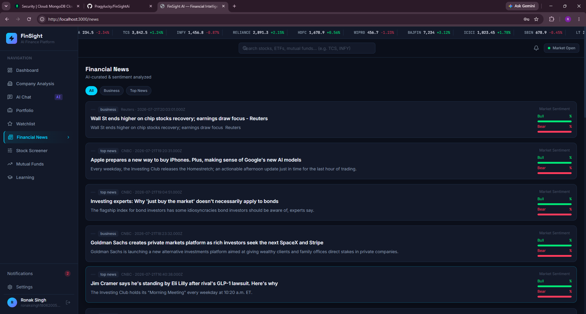
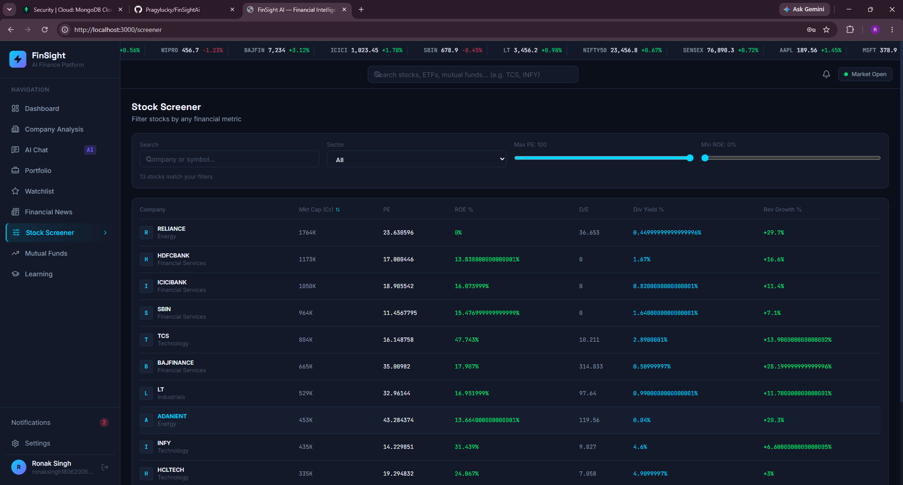
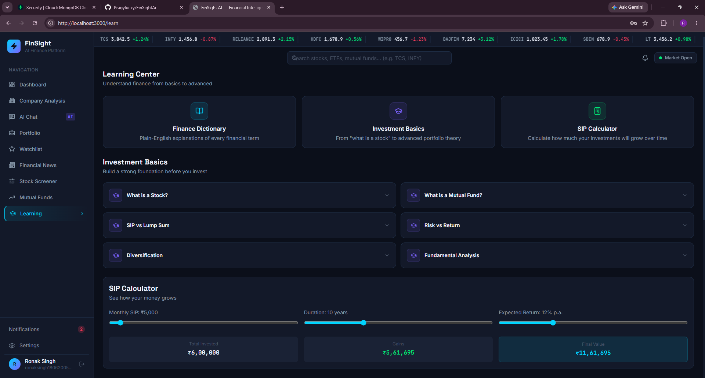

# 🚀 FinSight AI

> AI-Powered Financial Intelligence Platform for smarter investment research, portfolio management, and financial analysis.


---

## 📖 Overview

FinSight AI is a modern full-stack financial intelligence platform built to simplify stock market research and portfolio management.

Users can analyze companies, manage their investment portfolio, create personalized watchlists, explore financial news, interact with an AI financial assistant, and learn investing concepts—all from a single responsive dashboard.

The project combines modern web technologies with financial APIs and AI to provide an intuitive investment research experience.

---

# ✨ Features

## 📊 Dashboard

- Personalized greeting
- Market overview
- Portfolio summary
- Profit & Loss tracking
- Watchlist overview
- Top Gainers & Losers
- Sector allocation charts
- Market ticker

---

## 📈 Company Analysis

- Search listed companies
- Live stock information
- Company overview
- Financial statements
- Revenue & Profit charts
- Balance Sheet
- Quarterly Results
- Key Financial Ratios
- Interactive visualizations
- AI-generated company summary

---

## 💼 Portfolio Management

- Add & manage holdings
- Track invested amount
- Current portfolio value
- Profit & Loss calculation
- Portfolio analytics
- Sector allocation

---

## ⭐ Watchlist

- Add favorite stocks
- Live market prices
- Target price tracking
- Personal notes
- Quick company access

---

## 🤖 AI Financial Assistant

- Explain financial concepts
- Simplify financial reports
- Company insights
- Investment-related Q&A
- Powered by Google Gemini

---

## 📰 Financial News

- Latest financial news
- Company-specific news
- Market headlines

---

## 🔍 Stock Screener

- Browse companies
- Financial filters
- Company comparison

---

## 💰 Mutual Funds

- Browse mutual funds
- Fund information
- Performance overview

---

## 📚 Learning Hub

- Investment basics
- Financial concepts
- Beginner-friendly learning resources

---

# 🔐 Authentication

- User Registration
- Secure Login
- JWT Authentication
- Email Verification
- Protected Routes
- Password Hashing

---

# 🛠 Tech Stack

## Frontend

- React.js
- Vite
- Tailwind CSS
- React Router
- Axios
- Recharts
- Lucide React

## Backend

- Node.js
- Express.js
- JWT Authentication
- REST APIs
- Express Validator
- Bcrypt
- Nodemailer

## Database

- MongoDB Atlas

## AI & External APIs

- Google Gemini API
- Finnhub API

---

# 📂 Project Structure

```text
FinSightAI
│
├── finsight-frontend
│   ├── public
│   ├── src
│   │   ├── components
│   │   ├── context
│   │   ├── data
│   │   ├── pages
│   │   ├── services
│   │   └── assets
│   └── package.json
│
├── finsight-backend
│   ├── config
│   ├── controllers
│   ├── middleware
│   ├── models
│   ├── routes
│   ├── services
│   ├── utils
│   └── package.json
│
└── README.md
```

---

# 📸 Screenshots

| Dashboard | Company Analysis |
|------------|------------------|
|  |  |

| Portfolio | Watchlist |
|------------|------------|
|  |  |

| AI Assistant | Financial News |
|---------------|----------------|
|  |  |

| Stock Screener | Learning Hub |
|-----------------|--------------|
|  |  |

---

# 🚀 Installation

## Clone Repository

```bash
git clone https://github.com/Pragylucky/FinSightAi.git
cd FinSightAi
```

---

## Frontend

```bash
cd finsight-frontend
npm install
npm run dev
```

Runs on:

```
http://localhost:3000
```

---

## Backend

```bash
cd finsight-backend
npm install
npm run dev
```

Runs on:

```
http://localhost:5000
```

---

# 🔑 Environment Variables

Create a `.env` file inside the backend folder.

```env
PORT=5000

MONGODB_URI=YOUR_MONGODB_URI

JWT_SECRET=YOUR_SECRET

JWT_EXPIRE=7d

EMAIL_USER=YOUR_EMAIL

EMAIL_PASS=YOUR_EMAIL_PASSWORD

GEMINI_API_KEY=YOUR_GEMINI_KEY

FINNHUB_API_KEY=YOUR_FINNHUB_KEY
```

---

# 🎯 Future Improvements

- Real-time stock price updates
- AI portfolio recommendations
- Advanced stock alerts
- News sentiment analysis
- Portfolio performance forecasting
- Mobile application
- Dark / Light theme

---
🌐 Live Demo:
https://fin-sight-ai-six-kappa.vercel.app

⚙️ Backend API:
https://finsight-backend-jlvd.onrender.com

# 👨‍💻 Author

### Ronak Singh

- GitHub: https://github.com/Pragylucky
- LinkedIn: https://www.linkedin.com/in/ronak-singh-79234328a/

---

# ⭐ Support

If you found this project useful, consider giving it a ⭐ on GitHub!

It helps others discover the project and motivates future development.

---

## 📄 License

This project is licensed under the MIT License.
