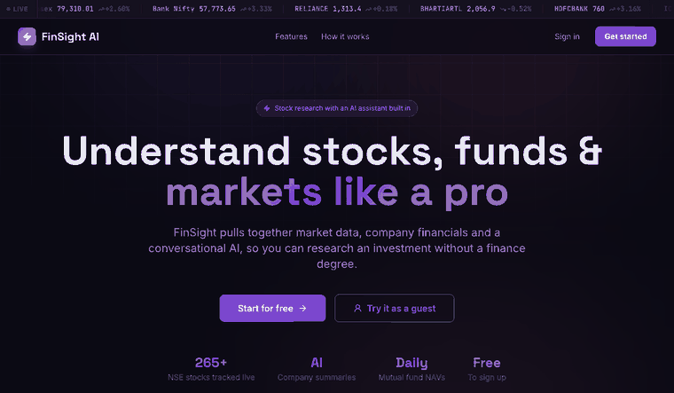
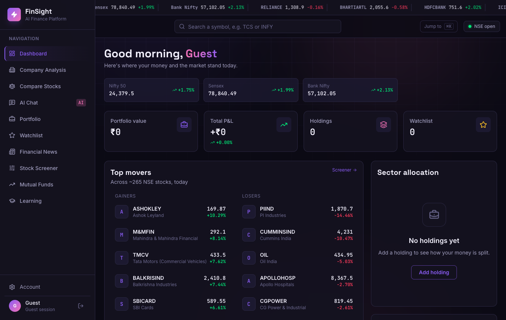
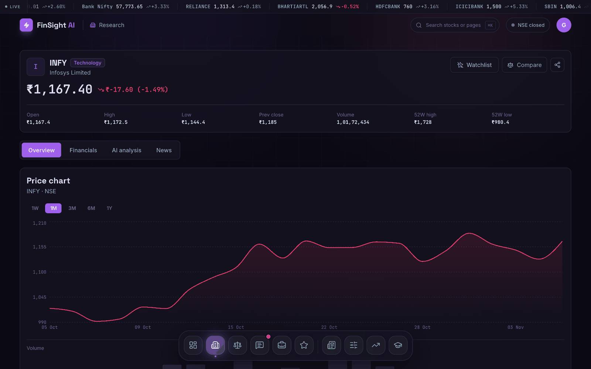
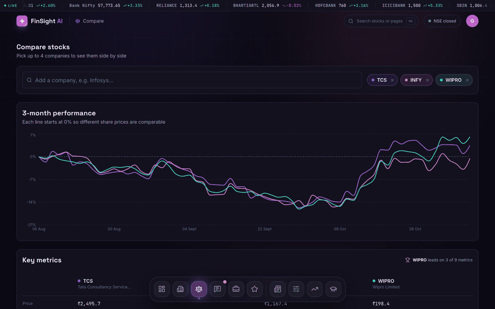
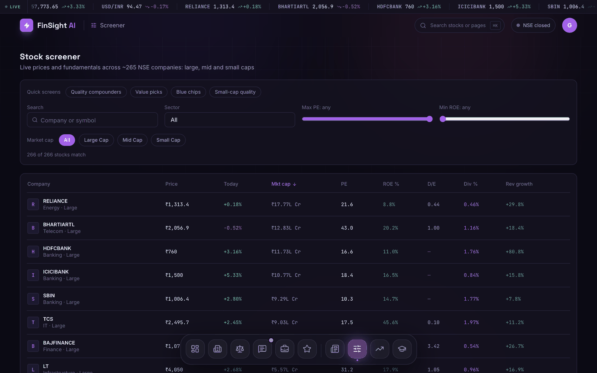
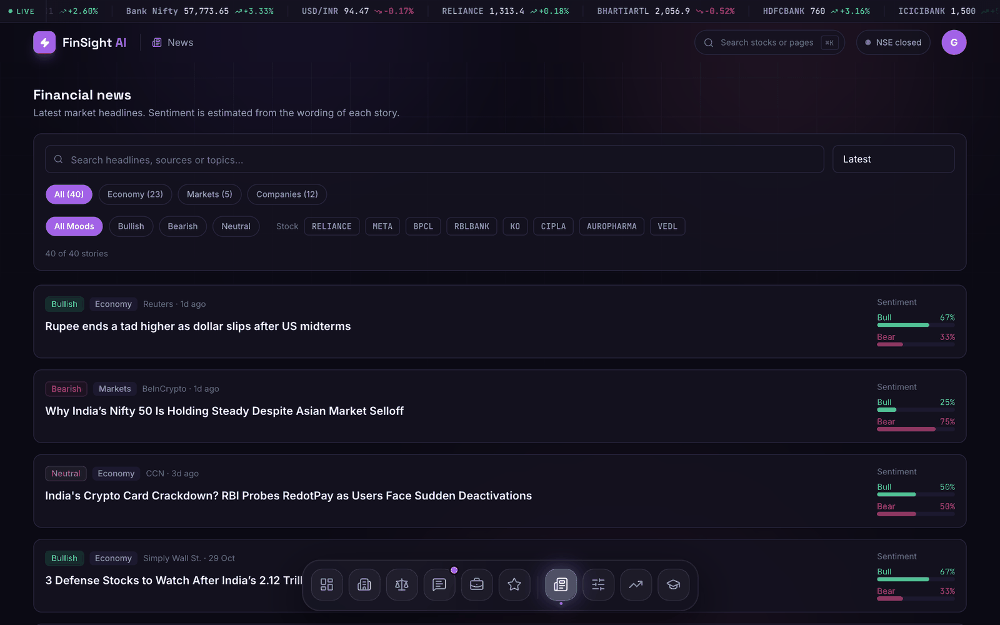
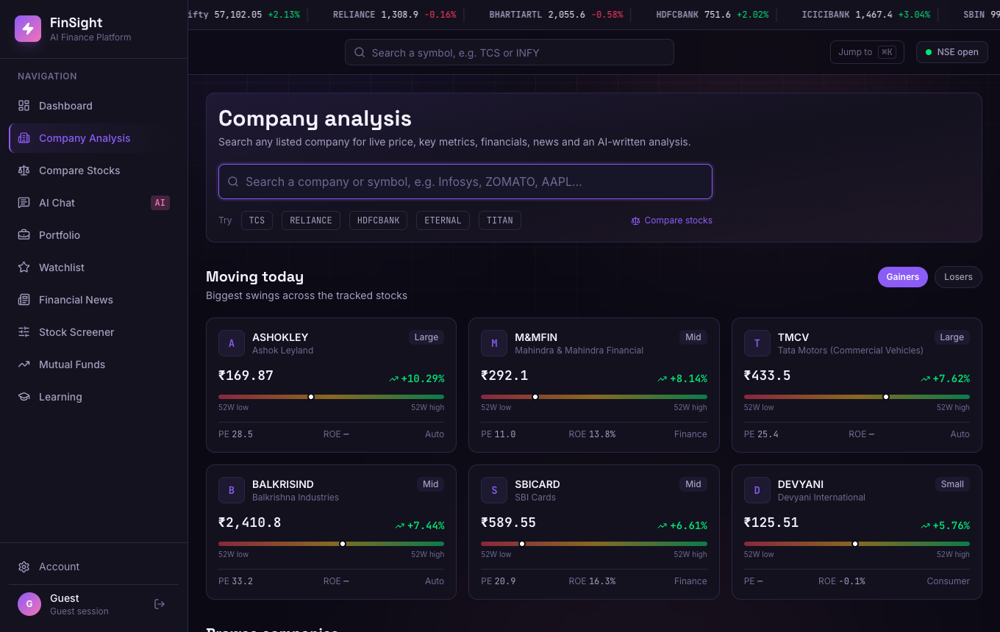
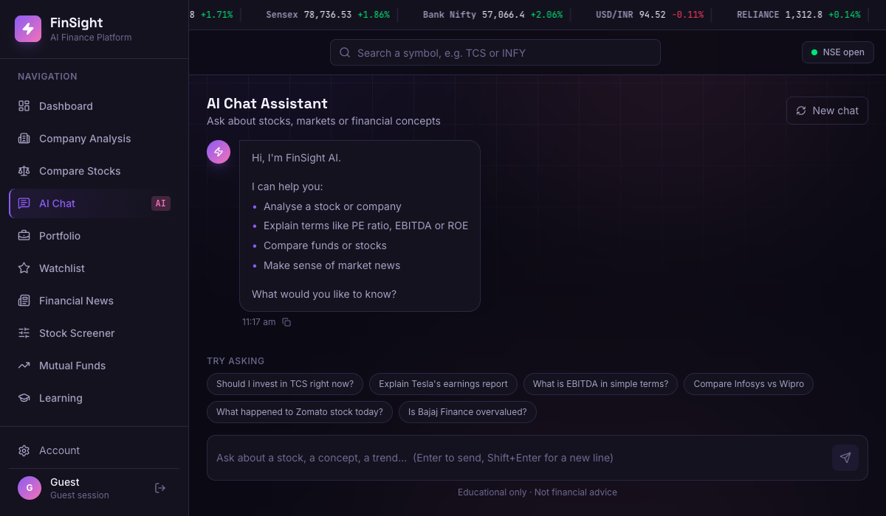
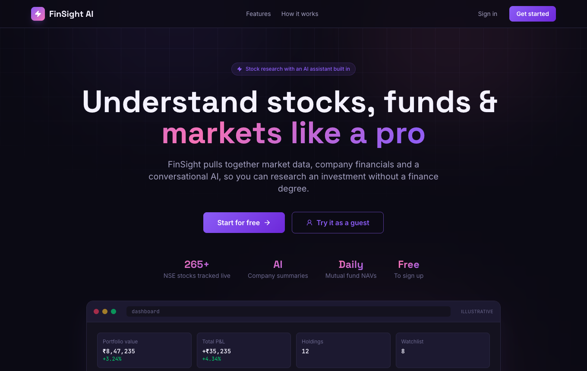
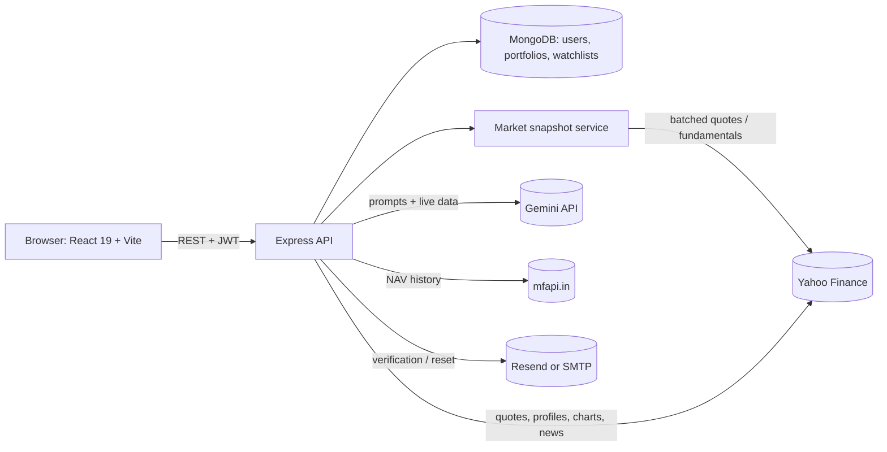

<div align="center">


<a href="https://fin-sight-ai-six-kappa.vercel.app"></a>

[](https://github.com/Pragylucky/FinSightAi/actions/workflows/ci.yml)


### [**Live demo**](https://fin-sight-ai-six-kappa.vercel.app) &nbsp;·&nbsp; [API health](https://finsight-backend-jlvd.onrender.com/health) &nbsp;·&nbsp; [Report a bug](https://github.com/Pragylucky/FinSightAi/issues)

<sub>Tip: click **Try it as a guest** on the demo, no sign-up needed. The API runs on a free tier, so the first request after idle can take ~30 seconds.</sub>



<sub>A 30-second tour recorded from the live app: guest login, ⌘K palette, company analysis, compare, screener, news, AI chat</sub>

</div>

---

## What it does

| | |
|---|---|
| **Live market data** | Real prices, indices, top gainers/losers and a ticker, for ~265 NSE stocks (large, mid and small caps), refreshed from Yahoo Finance. No mock data. |
| **Company analysis** | Search any listed company: live quote, price chart, key metrics (PE, PB, ROE, debt/equity, yield), quarterly results, news and an **AI-written analysis** with strengths, risks, outlook and a risk score. |
| **Compare stocks** | Up to four companies side by side: a rebased 3-month performance chart plus a metrics table with the best value in each row marked. |
| **Stock screener** | Filter ~265 stocks by sector, market-cap class, PE and ROE; sort any column; fundamentals stream in the background. |
| **AI chat** | Gemini-powered assistant that is handed **live quotes and ratios** for any stock you mention, so answers use real numbers. |
| **News** | Market headlines with search and filters (topic, stock, sentiment) and a sentiment estimate per story. |
| **Portfolio & watchlist** | Add holdings and targets, see value and P&L at live prices, sector allocation and per-holding returns. |
| **Mutual funds, SIP calculator, finance dictionary** | Fund returns from NAV history, a SIP growth calculator and a plain-English glossary. |
| **Polish** | Command palette (⌘K), page transitions, guest mode, responsive down to phone width, keyboard-accessible, reduced-motion aware. |

<table>
  <tr>
    <td></td>
    <td></td>
  </tr>
  <tr>
    <td></td>
    <td></td>
  </tr>
  <tr>
    <td></td>
    <td></td>
  </tr>
  <tr>
    <td></td>
    <td></td>
  </tr>
</table>

---

## Product thinking

This was built like a product, not just a codebase.

| | |
|---|---|
| **[Product brief](docs/PRODUCT.md)** | Problem, target user, positioning against existing tools, RICE prioritisation (including what I chose *not* to build), success metrics, risks, roadmap |
| **[AI evaluation](docs/EVAL.md)** | Labelled test sets for grounding, faithfulness, honesty and safety. Runs in CI; stock-mention detection scores 93% precision / 93% recall |
| **[User testing plan](docs/USER_TESTING.md)** | Task script and recording template for validating the assumptions in the brief |

**AI quality loop, built into the app:**
- **Transparent:** the analysis shows exactly which figures the model was given ("What is this based on?"); chat shows which live data grounded the answer and when.
- **Measured:** 👍/👎 with a reason on every analysis and chat answer, plus latency, token cost, error rate and guardrail flags per call, via `GET /api/ai/stats`.
- **Guarded:** the disclaimer is added server-side and risky phrasing (guaranteed returns, hard buy/sell calls, price targets) is flagged, so safety doesn't depend on the prompt.
- **Funnel analytics:** guest → company page → AI analysis, via `GET /api/events/funnel`.

---

## Engineering highlights

These are the problems that were interesting to solve, not just features that were wired up.

- **Resilient market-data layer.** Yahoo's response schema changes often; a strict validation error used to blank an entire company profile. Calls now run with `validateResult: false`, fall back to a lighter endpoint, and serve the **last good value from a 24-hour stale cache** instead of failing, and the app never fabricates data. When a source is down it says so.
- **Background snapshot service.** Screener, movers, ticker and landing page are served from an in-memory snapshot of ~265 stocks: two batched quote calls every 5 minutes, plus a bounded worker pool (5 concurrent) that fetches slower fundamentals once a day. First paint is instant instead of ~265 calls per request; partial data is flagged so the UI can show progress.
- **AI that isn't blocking and isn't made up.** Analysis lives on its own cached endpoint (6 h TTL) so a slow model call never breaks the company page; output is parsed defensively (markdown fences, extra prose) and validated; on failure it returns an error with a retry instead of a fake "Neutral" result. Chat detects stocks in the user's message and injects live data into the prompt.
- **Auth hardened end to end.** JWT access token plus `httpOnly` refresh cookie (`SameSite=None; Secure` in production for the cross-site Vercel ↔ Render setup), refresh-interceptor that can't deadlock on auth endpoints, rate limiting per IP behind a proxy, hashed reset tokens, optional email verification via a **6-digit code** (hashed at rest, 15-minute expiry, 5-attempt cap, resend cooldown), and one-click **guest accounts** that a nightly job garbage-collects.
- **Safe rendering.** AI replies go through a small Markdown renderer that builds React nodes (no `innerHTML`), closing an XSS hole.
- **Frontend architecture.** Route-level code splitting, a single design-token layer (CSS variables → Tailwind) so the whole palette changes in one place, shared motion primitives (`Stagger`, `Reveal`, `CountUp`), an error boundary, accessible modals/tabs, and a `prefers-reduced-motion` guard.
- **Quality gates.** ESLint clean, unit tests for the pure logic (symbol resolution, sentiment scoring, stock mention detection, formatters, universe integrity) and a GitHub Actions workflow that lints, tests and builds both apps on every push.

---

## Architecture


```mermaid
flowchart LR
  U[Browser: React 19 + Vite] -- REST + JWT --> API[Express API]
  API --> DB[(MongoDB: users, portfolios, watchlists)]
  API --> MS[Market snapshot service]
  MS -- batched quotes / fundamentals --> Y[(Yahoo Finance)]
  API -- quotes, profiles, charts, news --> Y
  API -- prompts + live data --> G[(Gemini API)]
  API -- NAV history --> MF[(mfapi.in)]
  API -- verification / reset --> E[(Resend or SMTP)]
```

```
finsight-frontend/   React app (pages, components, motion, lib, tests)
finsight-backend/    Express API (controllers, services, models, middleware, tests)
.github/workflows/   CI: lint + test + build for both apps
assets/              screenshots used in this README
```

---

## Tech stack

**Frontend** React 19, Vite, React Router 7, Tailwind CSS, Framer Motion, Recharts, Lucide icons, Axios
**Backend** Node.js, Express, Mongoose, JWT, bcrypt, Helmet, express-rate-limit, node-cron, Nodemailer / Resend
**Data & AI** Yahoo Finance (`yahoo-finance2`), mfapi.in, Google Gemini
**Tooling** ESLint, Node's built-in test runner, GitHub Actions, Vercel (frontend), Render (backend), MongoDB Atlas

---

## Getting started

Prerequisites: Node 20+, a MongoDB connection string, and (optional) a [Gemini API key](https://aistudio.google.com).

```bash
git clone https://github.com/Pragylucky/FinSightAi.git
cd FinSightAi

# Backend
cd finsight-backend
cp .env.example .env        # fill in MONGODB_URI, JWT secrets, GEMINI_API_KEY
npm install
npm run dev                 # http://localhost:5000

# Frontend (new terminal)
cd finsight-frontend
npm install
echo "VITE_API_URL=http://localhost:5000/api" > .env
npm run dev                 # http://localhost:3000
```

Everything works without an email provider: with verification off (the default) sign-up logs you in immediately, and **Try it as a guest** needs nothing at all.

### Environment variables

| Variable | Where | Purpose |
|---|---|---|
| `MONGODB_URI` | backend | Database connection |
| `JWT_SECRET`, `JWT_REFRESH_SECRET` | backend | Token signing (use long random strings) |
| `CLIENT_URL` | backend | Allowed CORS origin and link base (no trailing slash) |
| `GEMINI_API_KEY` | backend | AI chat and company analysis |
| `GEMINI_MODEL` | backend, optional | Override the default model |
| `REQUIRE_EMAIL_VERIFICATION` | backend, optional | `true` to require the emailed 6-digit code |
| `RESEND_API_KEY` or `EMAIL_HOST/PORT/USER/PASS` | backend, optional | Email for codes and password reset |
| `FINNHUB_API_KEY` | backend, optional | Extra global headlines |
| `NODE_ENV=production` | backend | Enables secure cross-site cookies |
| `EXTRA_ORIGINS` | backend, optional | Extra comma-separated allowed origins, e.g. a Vercel preview URL |
| `VITE_API_URL` | frontend | Backend base URL, ending in `/api` |

See [`finsight-backend/.env.example`](finsight-backend/.env.example) for the full list.

### Tests

```bash
cd finsight-backend  && npm test         # unit tests + AI grounding eval
cd finsight-backend  && npm run eval     # live-model eval (needs GEMINI_API_KEY)
cd finsight-frontend && npm run lint && npm test && npm run build
```

---

## API overview

All routes are under `/api`. Everything except auth and `GET /market/pulse` requires a bearer token.

| Area | Endpoints |
|---|---|
| Auth | `POST /auth/register` · `/login` · `/guest` · `/refresh` · `/logout` · `/verify-email` · `/resend-code` · `/forgot-password` · `/reset-password/:token` · `GET /auth/me` |
| Market | `GET /market/overview` · `GET /market/pulse` (public) |
| Companies | `GET /companies/search?q=` · `/:symbol` · `/:symbol/analysis` · `/:symbol/chart?days=` · `/:symbol/quote` · `/:symbol/news` |
| Screener | `GET /screener` (sector, cap, PE/ROE filters, sort, paging) · `/screener/sectors` |
| Portfolio / watchlist | `GET/POST /portfolio`, `/portfolio/holdings` · `GET/POST/PUT/DELETE /watchlist` |
| News · Funds | `GET /news` · `GET /mutual-funds` |
| AI | `POST /ai/chat` · `POST /ai/feedback` · `GET /ai/stats` |
| Analytics | `POST /events` · `GET /events/funnel` |

---

## Deploying

- **Backend (Render or similar):** set the variables above, `NODE_ENV=production`, and `CLIENT_URL` to your frontend URL. Free tiers block outbound SMTP, so use `RESEND_API_KEY` if you enable verification or password reset.
- **Frontend (Vercel):** set `VITE_API_URL` to `https://<your-api>/api` and redeploy.
- After a cold start the stock snapshot warms in the background (~1 minute); the ROE / debt / growth columns fill in as they arrive.

---

## Roadmap

- Real-time quotes over WebSockets and price alerts
- Historical portfolio performance (daily snapshots)
- Persisted chat history and saved screens
- Broader coverage: all NSE equities and BSE, with sector indices

---

## Author

**Ronak Singh**
[GitHub](https://github.com/Pragylucky) · [LinkedIn](https://www.linkedin.com/in/ronak-singh-79234328a/)

> **Disclaimer:** FinSight AI is an educational project. Nothing here is financial advice, and sentiment and AI analysis are automated estimates that can be wrong. Do your own research.

Released under the [MIT License](LICENSE).
